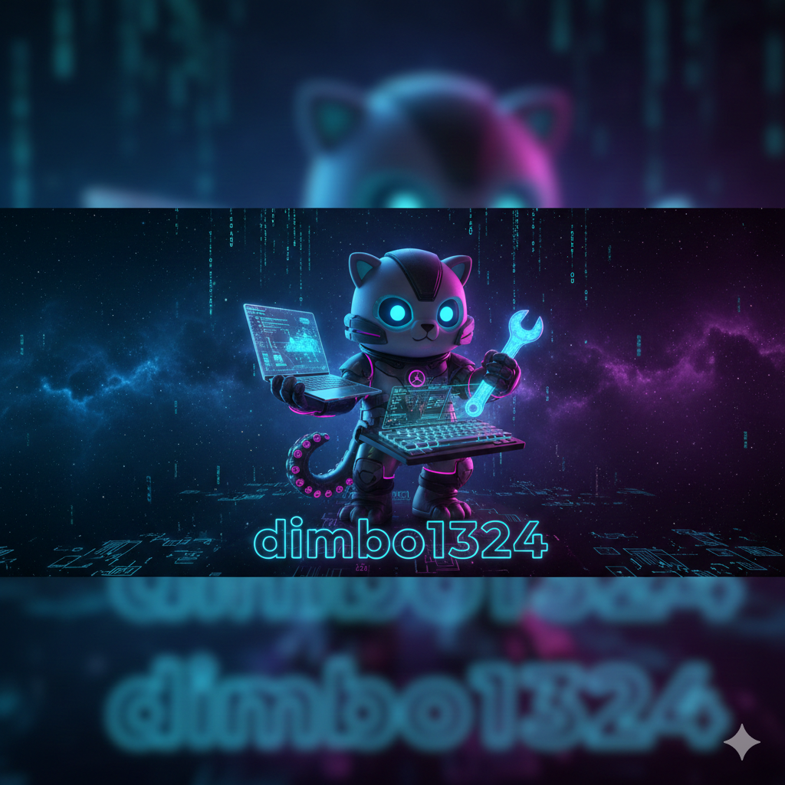

  
  
   
   

  

  <h2 style="border-bottom: none;">
    🚀 Инженерная физика | Промышленный AI | Цифровые близнецы
  </h2>

 

  

 

### 👨‍💻 Об инженере

Я **инженер-разработчик**, объединяющий фундаментальную науку и современные технологии. Мой бэкграунд включает веб-разработку, High-Performance Computing на C++ и теплофизику.

В данный момент я сфокусирован на **Scientific Machine Learning (SciML)**. Моя миссия — создавать алгоритмы, которые эффективно объединяют строгие физические законы с гибкостью нейросетей для решения сложных инженерных задач.

 

| 🔭 **Текущий фокус** | Разработка нейросетей, учитывающих физические законы (PINNs) для моделирования тепломассообмена. |
| :------------------ | :----------------------------------------------------------------------------------------------- |
| 🧬 **Мой подход**    | **Robust AI** = Data-Driven + Physics-Based Models.                                              |
| 🎓 **Образование**   | **Магистр** (Теплоэнергетика и Теплофизика), ИАТЭ.                                               |
| ⚡ **Интересы**      | Атомная энергетика, High-Load вычисления, AI/ML, Космос.                                         |

 

---

### 🛠 Технический Арсенал

|                                                                                                                                                                               **Languages**                                                                                                                                                                               |                                                                                                                                                                                                                                                                                                    **Scientific ML & Data**                                                                                                                                                                                                                                                                                                    |                                                                                                                                                                                                                                                                                                    **DevOps & Infrastructure**                                                                                                                                                                                                                                                                                                    |
| :-----------------------------------------------------------------------------------------------------------------------------------------------------------------------------------------------------------------------------------------------------------------------------------------------------------------------------------------------------------------------: | :----------------------------------------------------------------------------------------------------------------------------------------------------------------------------------------------------------------------------------------------------------------------------------------------------------------------------------------------------------------------------------------------------------------------------------------------------------------------------------------------------------------------------------------------------------------------------------------------------------------------------: | :-------------------------------------------------------------------------------------------------------------------------------------------------------------------------------------------------------------------------------------------------------------------------------------------------------------------------------------------------------------------------------------------------------------------------------------------------------------------------------------------------------------------------------------------------------------------------------------------------------------------------------: |
|    |      |      |

 

---

### 💡 Философия

  <i>"Simulation is the imagination of the machine, but Physics is its conscience."</i>
    
  Я убежден, что будущее инженерии — в гармоничном сочетании физических моделей и нейронных сетей.  Моя цель — системы, понимающие и законы природы, и паттерны данных.
  
    

  

 

---

  
  &nbsp;
  
  &nbsp;
  
  &nbsp;
  

