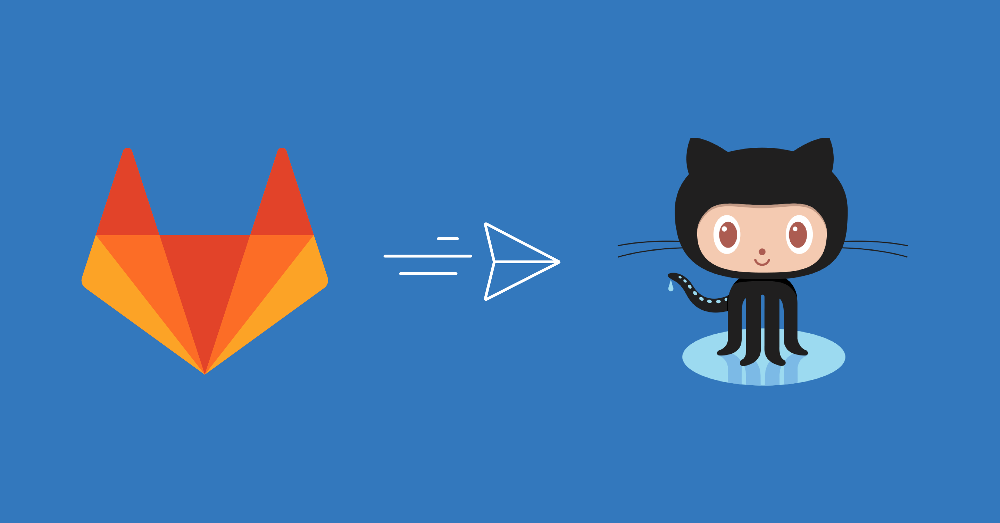

  

  <h1>Привет, я Дима! 👋</h1>

  

  

  <h3>🚀 Инженерная физика | Промышленный искусственный интеллект | Цифровые близнецы</h3>

---

### 👨‍💻 Обо мне

Я инженер-разработчик с опытом в **веб-разработке, бэкенд-разработке на С++, теплофизике и АСУТП**. В настоящее время я специализируюсь на **научном машинном обучении (Scientific Machine Learning)**.
Моя работа заключается в создании алгоритмов, которые эффективно объединяют физические законы с гибкостью нейросетей для решения сложных инженерных задач.

* 🔭 В настоящее время я занимаюсь разработкой **нейронных сетей, которые учитывают физические законы для моделирования тепломассообмена**.
* 🧬 Мой подход: **Надежный искусственный интеллект** = **Ориентированный на данные** + **Основанный на физических моделях**.
* 🎓 Образование: **Магистр** (Теплоэнергетика и Теплофизика) институт атомной энергетики и технической физики.
* ⚡ Интересы: Музыка, атомная энергетика, космос, йога, AI и ML, высокие технологии, высокопроизводительные вычисления.

---

### 🛠 Технический стек

<!-- Вставьте этот блок в README или в HTML-файл -->

  

    
Языки программирования

    

      
      
      
    

  

  

    
Фреймворки и библиотеки

    

      
      
      
      
      
    

  

  

    
Инфраструктура и DevOps

    

      
      
      
      
      
    

  

---

### 💡 Моя Философия

> *"Simulation is the imagination of the machine, but Physics is its conscience."*

Я убежден, что будущее инженерии — в гармоничном сочетании физических моделей и нейронных сетей, а не в замене одних другими. Моя цель — разрабатывать системы, которые одинаково хорошо понимают законы природы и паттерны в данных.

  

---

  
📫 <b>Связаться со мной:</b>

  
  
  
  

