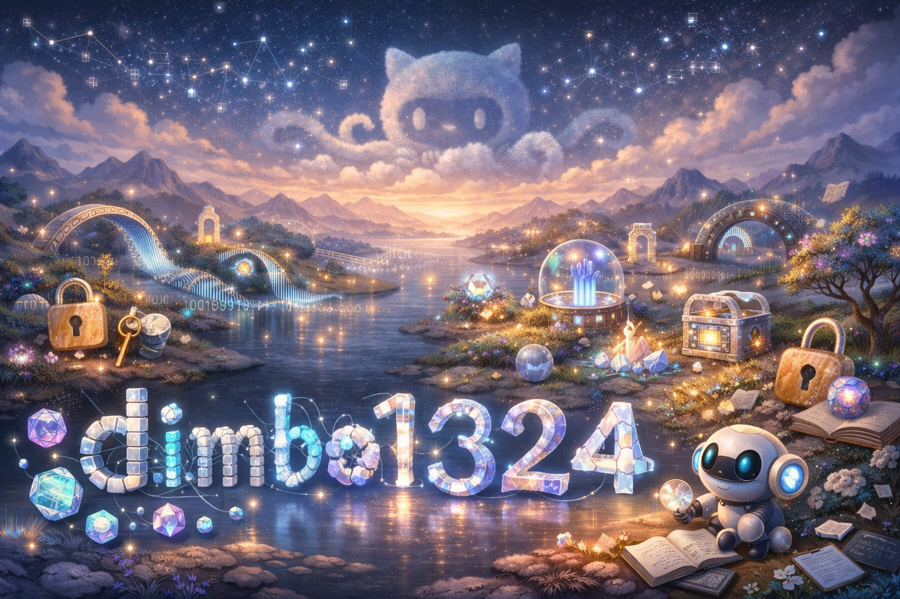

  
  

    

  

  <h3 style="color: #555; font-weight: 500;">
    Квантовая безопасность &nbsp;|&nbsp; Криптография на решетках &nbsp;|&nbsp; InfoSec
  </h3>

 

<table border="0" width="100%" style="border-collapse: collapse; border: none; font-family: 'Manrope', sans-serif;">
  <tr>
    <td width="55%" valign="top" style="padding-right: 20px; border: none;">
      <h2 style="border-bottom: none; margin-bottom: 10px;">🔐 Обо мне</h2>
      

        Я <b>инженер по квантовой криптографии</b>. Моя задача — обеспечить безопасность данных в эпоху, когда RSA и ECC станут уязвимы. Работаю на стыке квантовой физики и алгоритмической безопасности.
      

      

        Я разрабатываю протоколы распределения ключей (QKD) и внедряю постквантовые алгоритмы (PQC), устойчивые к атакам квантовых компьютеров.
      

       
      <ul style="list-style-type: none; padding: 0;">
        <li style="margin-bottom: 8px;">
          ⚛️ <b>Фокус:</b> Реализация протоколов <i>BB84 / E91</i> и алгоритмов Kyber/Dilithium.
        </li>
        <li style="margin-bottom: 8px;">
          🛡️ <b>Методология:</b> Security by Physics Laws + Lattice-based Math.
        </li>
        <li style="margin-bottom: 8px;">
          🎓 <b>Бэкграунд:</b> Квантовая оптика, Прикладная математика, C++.
        </li>
        <li>
          🌌 <b>Интересы:</b> Квантовый интернет, White-hat Hacking, Энтропия.
        </li>
      </ul>
    </td>
    <td width="45%" valign="middle" align="center" style="border: none;">
      
    </td>
  </tr>
</table>

 

  <h2 style="border-bottom: none;">🛠 Технический Арсенал</h2>
  
  <table style="border: none; border-collapse: collapse;">
    <tr style="border: none;">
      <td align="center" style="padding: 10px; border: none;">
        <b>Core & Security</b>  
        
        
        
        
      </td>
      <td align="center" style="padding: 10px; border: none;">
        <b>Quantum SDKs</b>  
        
        
        
        
      </td>
      <td align="center" style="padding: 10px; border: none;">
        <b>DevOps & Tools</b>  
        
        
        
        
      </td>
    </tr>
  </table>

 

  <h3 style="border-bottom: none; color: white;">💡 Философия Неопределенности</h3>
  

    "God does not play dice with the universe, but He uses quantum encryption."
  

  
  

    Истинная безопасность не в сложности алгоритма, а в природе материи. 
    Любая попытка подслушать квантовый канал необратимо разрушает информацию.
  

   
  

  

  
  &nbsp;
  
  &nbsp;
  
  &nbsp;
  

