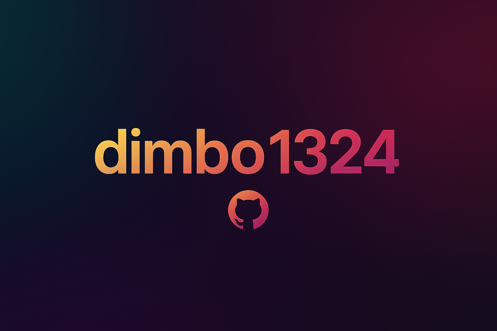

<!-- README.md (полный модернизированный вариант) -->

  <!-- Main title image (local fallback + remote) -->
  <picture>
    <source srcset="assets/tit6.png" type="image/png">
    
  </picture>

  <!-- Subtle animated GIFs (consider removing for noise) -->
  

    
    
  

  <!-- Gradient name -->
  <h1 style="margin: 8px 0 6px; font-size:34px; line-height:1.05;
             background: linear-gradient(90deg, #00A6C6 0%, #6C2BD9 34%, #FF3CAC 64%, #FFB75E 86%);
             -webkit-background-clip: text; background-clip: text; color: transparent;">
    Hey there, I’m Dmitry 👋
  </h1>

  

    <em>Software Engineer • C++ | Python | JavaScript • Crafting robust, scalable solutions for automation and beyond</em>
  

  

    <a href="#about-me" style="color:#00A6C6; text-decoration:none;">About Me</a> •
    <a href="#tech-stack" style="color:#6C2BD9; text-decoration:none;">Tech Stack</a> •
    <a href="#github-stats" style="color:#FF3CAC; text-decoration:none;">GitHub Stats</a> •
    <a href="#contact" style="color:#FFB75E; text-decoration:none;">Contact</a>
  

  <!-- quick profile metrics row -->
  

    <!-- profile views (ghpvc) -->
    
    <!-- github trophies -->
    
    <!-- visitor badge -->
    
  

---

# 🚀 About Me

I'm a dedicated software engineer with a strong foundation in automation, scientific computing, and industrial systems. My work focuses on leveraging C++ for high-performance applications, while exploring emerging technologies like computer vision and real-time data processing.

- 🎓 **Background**: Engineering expertise in automation and control systems.
- 💡 **Focus**: Automating complex processes with efficient, scalable code.
- 🌱 **Currently Learning**: Advanced computer vision techniques and real-time pipelines in C++.
- 📚 **Interests**: Fitness (gym, yoga, meditation, football), languages (English 🇬🇧, German 🇩🇪, Danish 🇩🇰), and classic literature.

For more details, check out my [LinkedIn profile (original)](https://www.linkedin.com/in/dmitry-prihodko-6282b8372/) or [personal website](https://yourwebsite.com).

---

# 🛠️ Tech Stack

I specialize in a mix of backend, frontend, and desktop technologies, emphasizing performance and reliability.

  <!-- shields row -->
  
  
  
  
  
  
  
  
  
  
  

---

# 📌 Пинованные репозитории

<!-- Используем github-readme-stats pin cards (замените названия репозиториев на реальные, если нужно) -->

  
  
  

*(Замените `some-cpp-project` на реальное имя репозитория или добавьте/удалите карточки по необходимости.)*

---

# 📊 GitHub Stats & Activity

  <!-- GitHub Stats (local fallback first) -->
  <picture>
    <source srcset="assets/github-stats.svg" type="image/svg+xml">
    
  </picture>

  <!-- Top Languages -->
  <picture>
    <source srcset="assets/top-langs.svg" type="image/svg+xml">
    
  </picture>

  <picture>
    <source srcset="assets/activity-graph.svg" type="image/svg+xml">
    
  </picture>

  <picture>
    <source srcset="assets/streak-stats.svg" type="image/svg+xml">
    
  </picture>

---

# 🔭 Currently working on

- Improving `presightserver` tests and controllers (C++ integration & unit test improvements).
- A personal static site (`dimbo-website`) — redesign & accessibility tweaks.
- Experiments with real-time computer vision pipelines in C++.

---

# 📫 Get in Touch

Feel free to reach out for collaborations, questions, or discussions.

  
  
  
  

