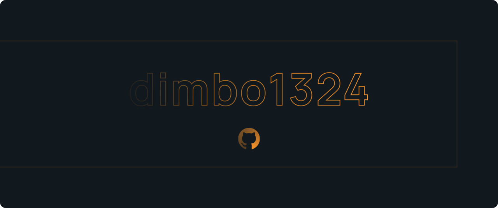

  <picture>
    <source srcset="assets/dark/banner.svg" media="(prefers-color-scheme: dark)">
    <source srcset="assets/light/banner.svg" media="(prefers-color-scheme: light)">
    
  </picture>
  <h1>Привет, я <strong>Дмитрий</strong> 👋</h1>
  
<em>Software Engineer — C++, Go, JavaScript & TypeScript</em>

## 🏆 Обо мне

- 🔭 Сейчас работаю над: **YourProjectName**  
- 🌱 Изучаю: *Rust, Kubernetes*  
- 👯 Ищу сотрудничество по open-source проектам  
- 💬 Всегда рад обсудить: архитектуру, высокую нагрузку, DevOps  

## 🛠 Мой стек

  <!-- C++ -->
  
  
  <!-- Go -->
  
  
  <!-- Node.js -->
  
  

  
  

## 📫 Контакты

  <a href="mailto:dimaprihodko180@gmail.com">📧 Email</a> •
  <a href="https://t.me/dimbo1324">💬 Telegram</a> •
  <a href="https://wa.me/79049265729">📱 WhatsApp</a>

