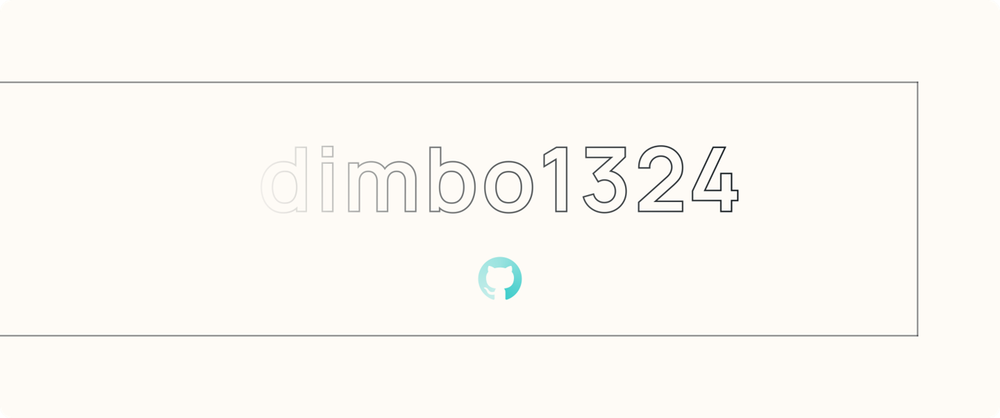

  <picture>
    <source media="(prefers-color-scheme: dark)" srcset="assets/light/title.png">
    <source media="(prefers-color-scheme: light)" srcset="assets/light/title.png">
    
  </picture>
  <!-- Horizontal GIFs for subtle animation, chosen for dark compatibility -->
  

    
    
  

  <h1><strong>Hey there, I’m Dmitry 👋</strong></h1>
  

    <em>Software Engineer • C++ | Python | JavaScript • Crafting robust, scalable solutions for automation and beyond</em>
  

  

    <a href="#about-me">About Me</a> •
    <a href="#tech-stack">Tech Stack</a> •
    <a href="#github-stats">GitHub Stats</a> •
    <a href="#contact">Contact</a>
  

---

## 🚀 About Me

I'm a dedicated software engineer with a strong foundation in automation, scientific computing, and industrial systems. My work focuses on leveraging C++ for high-performance applications, while exploring emerging technologies like computer vision and real-time data processing.

- 🎓 **Background**: Engineering expertise in automation and control systems.
- 💡 **Focus**: Automating complex processes with efficient, scalable code.
- 🌱 **Currently Learning**: Advanced computer vision techniques and real-time pipelines in C++.
- 📚 **Interests**: Fitness (gym, yoga, meditation, football), languages (English 🇬🇧, German 🇩🇪, Danish 🇩🇰), and classic literature.

For more details, check out my [LinkedIn profile](https://www.linkedin.com/in/your-linkedin) or [personal website](https://yourwebsite.com).

---

## 🛠️ Tech Stack

I specialize in a mix of backend, frontend, and desktop technologies, emphasizing performance and reliability.

### Core Languages & Frameworks

### Desktop & Build Tools

### Web Development

### Databases

Explore my repositories for projects demonstrating these skills.

---

## 📊 GitHub Stats & Activity

  
  

  

  

These visuals highlight my consistent contributions and language preferences.

---

## 📫 Get in Touch

Feel free to reach out for collaborations, questions, or discussions.

  
  
  
  

---

This profile is powered by open-source tools like [GitHub Readme Stats](https://github.com/anuraghazra/github-readme-stats) and [Shields.io](https://shields.io). Last updated: August 2025.
